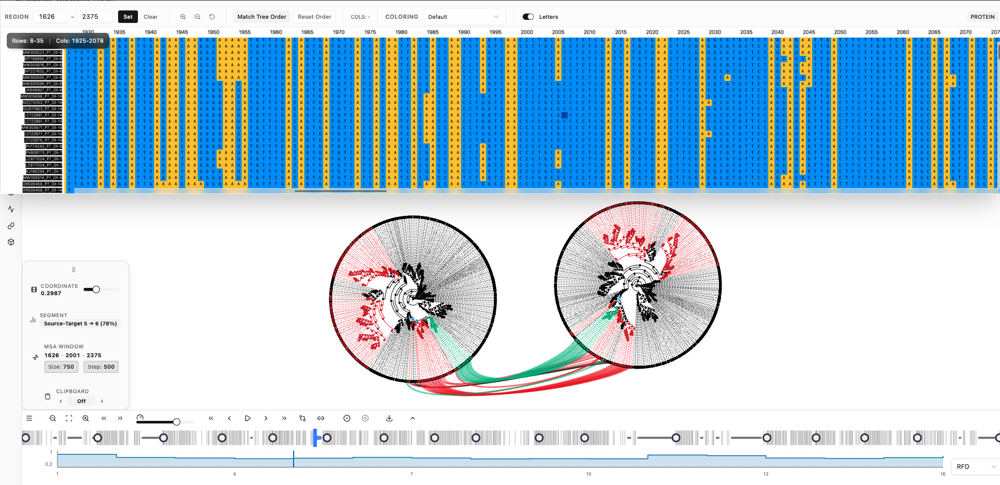

# Phylo-Movies

[](https://github.com/enesBerkSakalli/phylo-movies/actions/workflows/ci.yml)
[](https://opensource.org/licenses/MIT)
[](https://doi.org/10.64898/2026.04.01.715821)

[Website](https://enesberksakalli.github.io/phylo-movies/) ·
[Browser demo](https://enesberksakalli.github.io/phylo-movies/demo/) ·
[Source code](https://github.com/enesBerkSakalli/phylo-movies) ·
[Publication](https://doi.org/10.64898/2026.04.01.715821)

Phylo-Movies is a React and Flask web tool for inspecting ordered phylogenetic tree series. It uses the BranchArchitect backend to compute subtree-prune-and-regraft transition frames between input trees, then renders the resulting movie in a WebGL tree viewer with timeline, comparison, MSA, coloring, analytics, image, and recording tools. It is intended for computational biologists, phylogenetics method developers, and instructors who need to see which taxa or subtrees move between neighboring trees.



The project information page at [enesberksakalli.github.io/phylo-movies](https://enesberksakalli.github.io/phylo-movies/) includes documentation and a precomputed browser demo. Dataset loading, interpolation, and MSA-driven workflows require the full-stack app from source, Docker, or the Electron desktop build.

## Choose the Right Entry Point

| Entry point | Use it for | Backend-dependent actions |
| --- | --- | --- |
| GitHub Pages site | Reading documentation, downloading releases/data, and opening generated demo movies at `/demo`. | New uploads, local example processing, interpolation, and MSA workflows do not run on the static site. |
| Source checkout | Development and full local processing from the browser. | Run `./start.sh`, keep the terminal open, and use the printed `http://127.0.0.1:5173/` URL. |
| Docker | Full-stack local execution without manually setting up the backend. | Run `docker compose up --build` and open `http://localhost:8080/`. |
| Desktop release | Packaged local app for end users. | macOS release artifacts may be unsigned; see [Troubleshooting](docs/troubleshooting.md#symptom-macos-says-the-app-is-damaged). |

## Quick Start

Requirements:

- Node.js 22.12.0 or newer with npm 10 or newer
- Python 3.11 or newer
- Poetry
- Git

On macOS, Poetry can be installed without `sudo` through Homebrew:

```bash
brew install poetry
```

```bash
git clone --recurse-submodules https://github.com/enesBerkSakalli/phylo-movies.git
cd phylo-movies
npm ci
./start.sh
```

Open <http://127.0.0.1:5173/>. The startup script runs the BranchArchitect Flask backend on <http://127.0.0.1:5002/> and the Vite frontend on <http://127.0.0.1:5173/>. Keep the terminal running while using the browser app; stopping the script stops the local backend.

## First Successful Run

1. Start the full stack with `./start.sh`.
2. Open <http://127.0.0.1:5173/>.
3. Select **Example Library**.
4. Click **Load** on **Paper Figure Example**.
5. Wait for processing to finish and the app to open `/visualization`.
6. Use the bottom transport controls to step through generated frames.
7. Use the top-right canvas buttons to fit, zoom, export an image, or record the canvas.

## Documentation

- [Getting started](docs/getting-started.md)
- [Usage](docs/usage.md)
- [Web interface](docs/web-interface.md)
- [Configuration](docs/configuration.md)
- [API](docs/api.md)
- [Examples](docs/examples.md)
- [Development](docs/development.md)
- [Deployment](docs/deployment.md)
- [Troubleshooting](docs/troubleshooting.md)

Specialized source folders also keep their own documentation:

- [Electron desktop app](electron-app/README.md)
- [BranchArchitect backend](engine/BranchArchitect/README.md)
- [Publication data](publication_data/README.md)
- [Frontend tests](test/README.md)

The root README and `docs/` are the canonical user and developer documentation for the combined web tool. The `wiki/` folder contains reviewer-response and analysis notes, not installation instructions.

## Development Commands

```bash
./start.sh                 # Start backend on 5002 and frontend on 5173
npm run dev                # Start the Vite frontend only
npm run build              # Build frontend assets and copy example data
npm run preview            # Preview dist/ on 4173
npm run lint               # Run ESLint
npm run typecheck          # Run TypeScript checks
npm run test               # Run frontend test suites
npm run validate           # Lint, typecheck, tests, and build for the frontend
npm run dev:electron       # Start the Electron wrapper workflow
```

Backend validation is separate:

```bash
cd engine/BranchArchitect
poetry run pytest test/ -v
```

## Citation

If you use Phylo-Movies in research, cite:

Sakalli, E. B., Haendeler, S. E., von Haeseler, A., and Schmidt, H. A. (2026). Animating Phylogenetic Trees from Sliding-Window Analyses. bioRxiv. <https://doi.org/10.64898/2026.04.01.715821>

Software citation metadata is in [CITATION.cff](CITATION.cff).

## License

Phylo-Movies is released under the MIT License. See [LICENSE](LICENSE).
