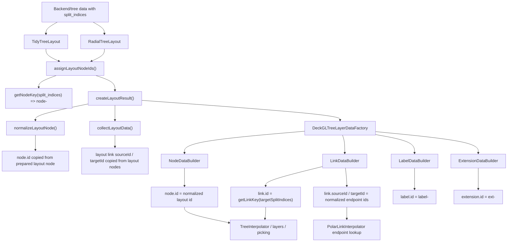

# Render Node and Link ID Call Map

## Summary

PhyloMovies render IDs for tree nodes, links, labels, and extensions are
generated from `split_indices`, not from arbitrary backend identifiers. The
canonical split identity helpers now live in `src/domain/tree/splits.js`.
Layout classes prepare node IDs once, normalization preserves those prepared
IDs, and deck.gl builders consume normalized IDs instead of recalculating node
identity downstream.

The former `src/treeVisualisation/utils/KeyGenerator.js` module has been
deleted in the current working tree. Its public render key helpers moved into
`src/domain/tree/splits.js`.

## Main Call Flow

## Canonical Generators

`src/domain/tree/splits.js` is the central split identity module. It provides
the split key machinery plus render ID helpers:

- `getNodeKey(node)` returns `node-${splitHash}`.
- `getLinkKey(link)` returns `link-${targetSplitHash}`.
- `getLabelKey(leaf)` returns `label-${splitHash}`.
- `getExtensionKey(leaf)` returns `ext-${splitHash}`.
- `getSplitKey()` resolves `split_indices`.
- `getSplitHash()` generates the stable order-independent hash used inside
  render IDs.

## Layout-Level ID Generation

`src/treeVisualisation/layout/LayoutBaseUtils.js` prepares layout node IDs:

- `assignLayoutNodeIds(root)` walks the D3 hierarchy and sets `node.id` with
  `getNodeKey({ split_indices: node.data.split_indices })`.
- `TidyTreeLayout` and `RadialTreeLayout` call `assignLayoutNodeIds()` in their
  constructors.
- `calculateBranchLengthRadii()` uses the prepared `node.id` when preserving
  previous node radii.

`src/treeVisualisation/layout/LayoutResultAdapter.js` normalizes D3 layout nodes
into app layout objects.

- `normalizeLayoutNode()` copies `data.split_indices`.
- It copies the prepared D3 `node.id`; it does not call `getNodeKey()`.
- The normalized node receives `id`, `parentId`, `split_indices`, `children`,
  and layout coordinates.
- `collectLayoutData()` emits layout link objects.
- Layout links no longer carry their own `id` at this stage.
- Layout links carry `sourceId`, `targetId`, `sourceSplitIndices`, and
  `targetSplitIndices`.

## Deck Layer Data ID Generation

`src/treeVisualisation/deckgl/DeckGLTreeLayerDataFactory.js` dispatches layout
data to the element builders.

`NodeDataBuilder.js`:

- Reuses normalized `node.id`.
- Adds `splitKey` metadata from `getSplitKey()`.
- Skips nodes with invalid coordinates or missing normalized IDs.

`LinkDataBuilder.js`:

- Computes final `link.id` as `link-${splitKey}` from
  `link.targetSplitIndices`.
- Reuses normalized `link.sourceId` and `link.targetId`.
- Adds `splitKey` metadata.
- Stores `polarData.source` and `polarData.target` for interpolation.
- The effective identity of a tree branch link is the target child split.

`LabelDataBuilder.js`:

- Generates `label-${splitHash}` from leaf split indices.
- Adds `splitKey` metadata.

`ExtensionDataBuilder.js`:

- Generates `ext-${splitHash}` from leaf split indices.
- Adds `splitKey` metadata.

## Interpolation Consumers

`ElementMatcher.js` builds `Map<id, element>` and performs update, enter, and
exit handling by element ID. The current implementation constructs maps with a
single loop instead of allocating an intermediate `elements.map(...)` array, and
uses `toMap.has(id)` to detect exiting elements.

`TreeInterpolator.js`:

- Builds cached ID maps for nodes, labels, links, and extensions.
- Uses those maps for interpolation.
- Builds velocity maps keyed by element ID during REORDER frames.

`animationStageDetector.js`:

- Compares node ID sets between source and target trees.
- Returns COLLAPSE when node IDs exit, EXPAND when IDs enter, and REORDER when
  node sets are stable.

`TransitionChangeModel.js`:

- Builds link lifecycle maps keyed by resolved link keys.
- Falls back through `splitKey`, split-derived key, and `id`.

## Link Endpoint Consumers

`PolarLinkInterpolator.js` uses `sourceId` and `targetId` to attach rendered
branch endpoints to interpolated node positions.

Important calls:

- `linkEndpointNodeId(entry, 'target')` indexes incoming lifecycle entries by
  target node ID.
- `_interpolateLinkEndpointPosition()` uses `sourceId` or `targetId` to find
  corresponding nodes in `nodeFromMap` and `nodeToMap`.
- If endpoint nodes are found, link endpoints follow node interpolation.
- If endpoint nodes are missing, the interpolator falls back to `polarData`.

## Connector ID Space

Connectors are separate from ordinary tree links.

`ComparisonUtils.js`:

- `buildPositionMap()` indexes comparison positions by
  `split_indices.join('-')`.
- It stores the hashed render `node.id` as metadata, but the map key is the raw
  joined split key.

`ConnectorLeafPairCandidates.js`:

- Reads candidate split indices from normalized leaf info with
  `getSplitIndices(info)`.
- Checks subtree membership with `isSubset(splitIndices, subtreeSet)`.
- Uses left and right leaf names to match connector pairs.

`ConnectorRawConnectionFactory.js`:

- Creates raw connector IDs as `connector-${leftKey}-${rightKey}`.

`ConnectorConnectionObjects.js`:

- Appends path suffixes such as `-active-0` or `-0` to create final rendered
  connector path IDs.

## ID Spaces

| ID Space | Format | Source | Used For |
|---|---|---|---|
| Tree node | `node-<splitHash>` | `assignLayoutNodeIds()` via `getNodeKey()` | node render identity, interpolation, stage detection |
| Tree link | `link-<splitHash>` | `LinkDataBuilder` on target split | branch render identity and link lifecycle |
| Label | `label-<splitHash>` | `LabelDataBuilder` via `getSplitKey()` | label interpolation and rendering |
| Extension | `ext-<splitHash>` | `ExtensionDataBuilder` via `getSplitKey()` | extension interpolation and rendering |
| Connector raw key | `<splitIndices.join("-")>` | `buildPositionMap()` | comparison connector matching |
| Connector ID | `connector-<leftKey>-<rightKey>` | `ConnectorRawConnectionFactory` | comparison connector identity |
| Connector path ID | `connector-...-active-0` or `connector-...-0` | `ConnectorConnectionObjects` | final connector path identity |

## Observations

- There are two active ID spaces: hashed render IDs and raw comparison connector
  keys.
- Tree link identity is target-node based.
- Layout node IDs are prepared before normalization, then copied forward.
- `LayoutResultAdapter` no longer creates initial layout link IDs. Final
  deck.gl link IDs are produced in `LinkDataBuilder`.
- `sourceId` and `targetId` are critical because `PolarLinkInterpolator` uses
  them to keep branches attached to interpolated node positions.
- `NormalizedRenderContract.test.js` now guards that builders reuse normalized
  layout IDs instead of recalculating node IDs.
- The wiki graph `node-*` and `link-*` identifier protocol in
  `knowledge/tools/environment.md` is documentation only right now; it is not
  implemented as an app graph export path.

## Connections

- [[tree-node-highlight-timing-flow]] covers how render identity, node
  highlighting, timing, and deck.gl layer responsibilities meet during
  transition playback.
- [[timeline-subsystem-review]] covers timeline segment construction and
  renderer coordination around these IDs.

## Open Questions

- Should connector keys use the same split hash format as render IDs to reduce
  dual-ID mental overhead?
- Should tests assert that `link.id` always equals
  `link-${targetId.replace(/^node-/, '')}`?
- Should data validation fail earlier when source tree nodes lack
  `split_indices`, since layout normalization now expects prepared node IDs?
