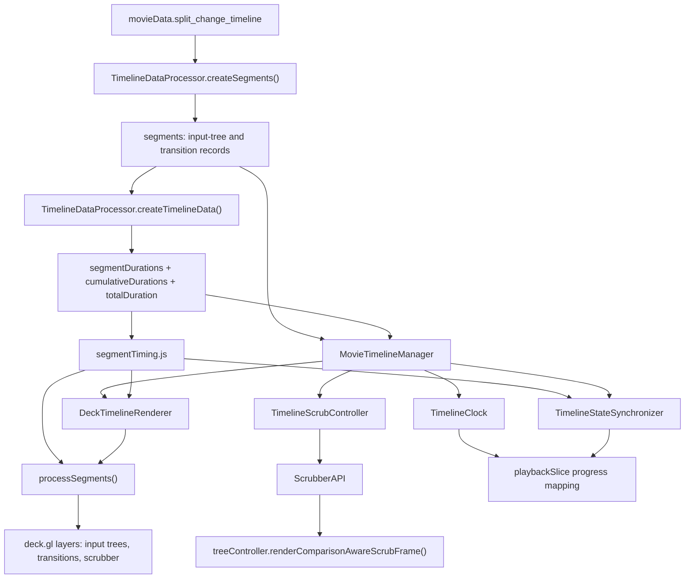

# Timeline Subsystem Review

## Summary

The timeline subsystem turns backend `split_change_timeline` data into weighted
timeline segments, renders those segments with deck.gl, and coordinates
clicking, hovering, scrubbing, playback progress, and tree rendering. It is a
bridge between backend transition semantics, the global playback store, and
[[phylogenetic-tree-morphing]].

The core design is sound: data construction, math, manager lifecycle, scrub
state, navigation policy, store synchronization, and WebGL rendering are split
into focused modules. The main maintenance risk is that timeline progress and
linear animation progress coexist and must stay carefully synchronized.

The current working tree centralizes segment bounds, segment lookup, and
zero-based/one-based segment ID conversion in
`src/timeline/utils/segmentTiming.js`. That replaces the narrower
`searchUtils.js` helper and removes several local `+ 1` / `- 1` conversions.

## Main Call Flow

## Data Construction

`TimelineDataProcessor.createSegments()` requires
`movieData.split_change_timeline`. It converts backend entries into frontend
timeline segments.

Input-tree segments:

- are created from entries where `entry.type === 'original'`
- set `segmentType: 'anchor'` as the implementation tag
- set `isFullTree: true`
- carry one `interpolationData` entry pointing to the input tree's global
  array index
- represent observed input trees in the UI

Transition segments:

- are created from entries where `entry.type === 'split_event'`
- set `segmentType: 'transition'`
- set `isFullTree: false`
- copy `globalStart`, `globalEnd`, `localStepStart`, and `localStepEnd`
- collect all interpolated tree frames in the global range
- resolve `affected_subtrees_by_split` from `tree_pair_solutions[pairKey]` via
  `getBackendSplitMapValue()`
- compute `subtreeMoveCount` as the distinct taxa count from flattened affected
  subtree sets

`TimelineDataProcessor.createTimelineData()` then computes:

- `segmentDurations`
- `cumulativeDurations`
- `totalDuration`

The duration model lives across `TimelineTimingBuilder`,
`TimelineTimingResolver`, and `TimelineMathUtils.calculateSegmentDurations()`:

- input-tree segments use `TIMING_PROFILE.inputTreeHoldMs`
- transition motion intervals use `TIMING_PROFILE.motionStepMs`
- semantic transition holds can be added for mover and pivot moments with
  `TIMING_PROFILE.moverHoldMs` and `TIMING_PROFILE.pivotHoldMs`
- fallback segments use `TIMING_PROFILE.motionStepMs`

## Timeline Math

`TimelineMathUtils` is the central conversion layer for progress and tree
selection. Shared segment timing primitives live in `segmentTiming.js`.

It owns:

- progress-to-time conversion
- time-to-progress conversion
- tree-index resolution from segment time
- interpolation data lookup for weighted timeline progress
- mapping between linear tree progress and weighted timeline progress

`segmentTiming.js` owns:

- `getSegmentBounds(segmentIndex, timelineData)`
- `timeToSegmentIndex(ms, timelineData, options)`
- `toTimelineItemId(segmentIndex)`
- `toSegmentIndex(itemId)`

Important behavior:

- `getTargetTreeForTime()` uses `timeToSegmentIndex()` and
  `getSegmentBounds()` to find the active segment and local segment time.
- Anchor segments resolve to their only `interpolationData` tree.
- Transition segments map local segment progress across the segment's
  interpolation data.
- `getInterpolationDataForTimelineProgress()` returns `{ fromTree, toTree,
  timeFactor, fromIndex, toIndex }` for renderer use.
- `getTimelineProgressForLinearTreeProgress()` maps legacy linear tree progress
  into the weighted timeline domain.
- `timeToSegmentIndex()` keeps existing default behavior for zero-duration
  boundary segments by preferring the last segment at the same cumulative time.
  Math callers can opt into first-boundary behavior with
  `{ preferLastAtSameTime: false }` and timeline-end inclusion with
  `{ includeEnd: true }`.

## Manager Lifecycle

`MovieTimelineManager` is the top-level coordinator.

It owns:

- segment creation
- timeline metadata
- `TimelineClock`
- `TimelineStateSynchronizer`
- `TimelineNavigationController`
- `TimelineScrubController`
- `ScrubberAPI`
- `DeckTimelineRenderer`
- store subscription wiring

The manager subscribes to store changes and schedules timeline updates with
`requestAnimationFrame()`. It recreates `ScrubberAPI` if the active tree
controller changes. Mounting creates a `DeckTimelineRenderer`, binds timeline
events, and restores renderer state from the store. Destroying cancels pending
frames, unmounts the renderer, destroys controllers, and clears references.

## Rendering

`DeckTimelineRenderer` renders the timeline using deck.gl and a custom
orthographic view.

It maintains:

- selected segment ID
- hovered segment ID
- visible time range
- current scrubber time
- resize and mouse event handlers
- reusable deck.gl layer instances

`processSegments()` converts visible timeline segments into render data:

- input-tree circles for sparse timelines
- input-tree ticks and strip tracks for dense timelines
- transition connection lines
- separator ticks
- hover and selection overlays

Segment IDs are 1-indexed for UI selection and event payloads. Segment arrays
remain 0-indexed internally, so conversions now go through
`toTimelineItemId()` and `toSegmentIndex()`.

## Interaction

`DeckTimelineRenderer` handles low-level mouse events and emits semantic
timeline events.

Mouse movement:

- computes the hovered segment from cursor time
- updates hover state in the store
- schedules layer refreshes

Mouse down:

- starts scrubbing only if the pointer is close to the scrubber

Mouse move while scrubbing:

- converts cursor x-position to timeline milliseconds
- updates scrubber time
- emits `timechange`

Mouse up:

- emits `timechanged`

Clicking:

- resolves the clicked segment
- uses `getTargetSegmentIndex()` so input-tree clicks near adjacent transition
  centers can target the adjacent transition
- emits `select`

Hover and click code now reads segment bounds with `getSegmentBounds()` instead
of open-coding `cumulativeDurations[index] - segmentDurations[index]`.

Wheel:

- zooms the visible time range around the cursor position

## Scrubbing

`TimelineScrubController` owns the scrub gesture state machine.

It:

- stops playback when scrubbing starts
- marks scrub state active
- throttles scrub rendering through `SCRUB_THROTTLE_MS`
- coalesces pending scrub positions
- calls `ScrubberAPI.updatePosition()`
- writes final timeline progress to the store when scrubbing ends

`ScrubberAPI` is the bridge from timeline progress to tree rendering.

It:

- clamps progress
- asks `MovieTimelineManager` for weighted timeline interpolation data
- falls back to linear interpolation if timeline data is unavailable
- updates store timeline progress and current tree index
- updates color-manager inputs for the previewed tree index
- calls `treeController.renderComparisonAwareScrubFrame()`

## Store Synchronization

`TimelineStateSynchronizer` keeps the deck timeline and store playhead aligned.

It chooses effective progress from:

- `playhead.timelineProgress` when preserving a scrub position
- mapped linear animation progress during playback

It then:

- moves the renderer scrubber with `setCustomTime()`
- selects the current segment
- updates store fields such as `currentSegmentIndex`, `treeInSegment`,
  `treesInSegment`, and `timelineProgress`

`playbackSlice.js` is timeline-aware. It stores both:

- `playhead.animationProgress`
- `playhead.timelineProgress`

This dual representation lets old linear playback and weighted timeline
scrubbing coexist. The mapping functions delegate to `MovieTimelineManager` when
available.

## Strengths

- The terminology aligns with [[project-terminology]]: input trees, transition
  frames, and timeline segments are separated.
- `TimelineMathUtils` centralizes progress, time, and tree-index conversion.
- `MovieTimelineManager` composes focused controllers rather than carrying all
  behavior inline.
- Scrub updates are throttled and coalesced, which protects render performance.
- `DeckTimelineRenderer` virtualizes visible segment processing by computing a
  buffered visible range.
- The renderer has a dense input-tree fallback mode using strip tracks and
  ticks.

## Risks

- The system has two progress spaces: linear animation progress and weighted
  timeline progress. Bugs are likely when a call path assumes one but receives
  the other.
- Segment IDs are 1-indexed in UI payloads and 0-indexed in arrays. This is
  now centralized in `segmentTiming.js`, but it is still easy to regress when
  new timeline code bypasses the helper.
- `timeToSegmentIndex()` has option-sensitive boundary semantics. Callers need
  to choose deliberately between default UI behavior, first-boundary math
  behavior, and timeline-end inclusion.
- `TimelineDataProcessor` assumes `tree_metadata[arrayIdx]` exists when an
  interpolated tree exists. If backend payload validation weakens, metadata
  holes could propagate into segment records.
- `subtreeMoveCount` is now a distinct taxa count derived from affected subtree
  sets. The name can still be ambiguous because it is not a count of SPR move
  events.
- Timeline rendering and store synchronization depend on `requestAnimationFrame`
  scheduling. This improves UI smoothness but requires tests to control RAF
  behavior carefully.

## Testing Surface

Relevant tests include:

- `test/timeline-construction.test.js`
- `test/timeline-math-utils.test.js`
- `test/timeline-navigation-controller.test.js`
- `test/timeline-manager-lifecycle.test.js`
- `test/deck-timeline-renderer.test.js`
- `test/scrubber-api.test.js`
- `test/segment-timing.test.js`
- `test/TimelineSegmentTooltip.test.js`

## Connections

- [[phylo-movies]]
- [[project-terminology]]
- [[phylogenetic-tree-morphing]]
- [[repository-architecture]]
- [[render-node-link-id-call-map]]
- [[tree-node-highlight-timing-flow]]

## Open Questions

- Should timeline progress and linear animation progress be wrapped in separate
  typed value objects or naming conventions to prevent accidental mixing?
- Should low-level pointer handling remain inside `DeckTimelineRenderer`, or
  should it move behind a smaller public interaction helper?
- Should the timeline public API reject invalid UI item IDs before
  `toSegmentIndex()` converts them into array indexes?
- Should `subtreeMoveCount` be renamed to indicate that it counts distinct
  affected taxa rather than SPR move events?
- Should timeline segment records have a documented schema page?
