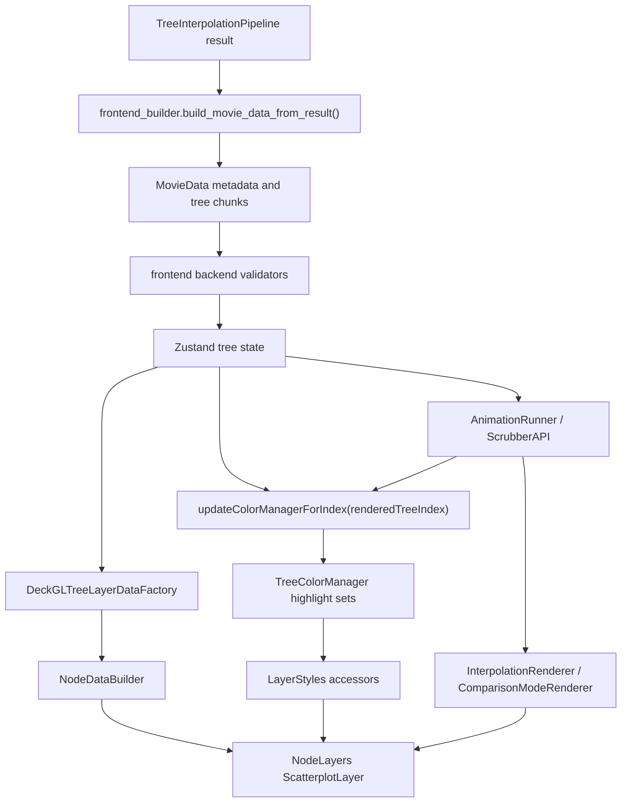

# Tree Node Highlight Timing Flow

## Summary

This page documents the narrow path where tree nodes, highlight state, and
animation timing meet. It connects [[brancharchitect]] backend transition data,
frontend store synchronization, and deck.gl rendering for
[[phylogenetic-tree-morphing]].

The guiding rule is the Rubik's cube rule: a local node, highlight, or timing
change is only correct when it still fits the connected backend data,
frontend state, deck.gl layer inputs, and playback path. The recursive rule is
that every fix must be re-checked through the linked path before it is treated
as complete.

## Data Flow

## Backend Contract

The backend sends node-bearing tree frames plus separate transition metadata.
`frontend_builder.py` serializes interpolated trees, `tree_metadata`,
`tree_pair_solutions`, `pivot_edge_tracking`, `subtree_highlight_tracking`,
`pair_interpolation_ranges`, and `split_change_timeline` into the frontend
payload.

The relevant backend-to-frontend meanings are:

- `interpolated_trees` are the ordered render frames consumed by the frontend.
- `tree_metadata` binds global frame indices to original trees, tree pairs,
  and local interpolation steps.
- `tree_pair_solutions` carries split-change events and moving-subtree
  solutions per source/target pair.
- `pivot_edge_tracking` is derived per global tree index from split-change
  events.
- `subtree_highlight_tracking` carries moving-subtree highlight state per
  frame.
- `split_change_timeline` is the weighted timeline input used to build anchor
  and transition segments.

## Node Rendering

Node render identity is split-based and is documented in
[[render-node-link-id-call-map]]. For this flow, the important invariant is
that `NodeDataBuilder.js` does not invent identity. It consumes normalized
layout nodes, preserves `node.id`, records `split_indices` and `splitKey`, and
emits deck.gl node objects with `position`, `renderPosition`, `dotSize`,
leaf/internal state, and metadata.

`NodeLayers.js` renders those nodes with one ScatterplotLayer. Position,
radius, fill color, border color, and border width are accessors that read the
current layer-style cache and store versions. Node highlighting is therefore
data-driven: render data supplies stable node identity and split metadata,
while `TreeColorManager` and `LayerStyles` decide emphasis.

## Highlight State

Highlight state is synchronized through `updateColorManagerForIndex(index)`.
That function is the single path used by normal navigation, scrubbing, and
playback. It gathers the rendered frame's marked subtrees, pivot edge,
history subtrees, source/destination edges, moving subtree, and upcoming or
completed change previews, then updates `TreeColorManager`.

The explicit index is required because the rendered frame can differ from
`currentTreeIndex` while playback or scrub rendering is in flight.
`updateColorManagerForCurrentIndex()` remains only as a convenience wrapper.

Comparison connectors follow the same rule. `ComparisonModeRenderer` builds
subtree connectors against an explicit active rendered tree index when static,
scrubbed, or animated comparison rendering supplies one. It falls back to the
store current index only when no explicit rendered index is available.

## Timing

There are two timing layers and they must not be blurred:

- `AnimationTiming.calculatePlaybackState()` converts wall-clock playback time
  into linear transition state: `fromIndex`, `toIndex`, `localT`, progress,
  and pause state.
- `TimelineMathUtils` converts weighted timeline progress into tree indices,
  segment progress, and interpolation pairs for scrub and timeline navigation.

During playback, `AnimationRunner` computes the active highlight frame from
the rendered interpolation pair: `localT < 0.5` uses `fromIndex`; otherwise it
uses `toIndex`. It synchronizes highlights before drawing the frame.

During scrubbing, `ScrubberAPI` asks timeline math for the rendered
interpolation pair and calls `updateColorManagerForIndex()` with the same
half-transition rule. `InterpolationRenderer` passes that active index into
comparison rendering, so comparison connectors and node highlights refer to
the same frame.

## Deck.gl Responsibilities

Deck.gl layer inputs should stay simple:

- `DeckGLTreeLayerDataFactory` converts normalized tree layout into renderable
  node, link, label, and extension arrays.
- `NodeDataBuilder` creates node objects from normalized layout nodes without
  recalculating identity.
- `NodeLayers` maps node data and color-manager state to ScatterplotLayer
  accessors and update triggers.
- `LayerManager` routes animated comparison frames with `activeTreeIndex`.
- `ComparisonModeRenderer` computes comparison geometry and connector data.
- `SubtreeConnectorBuilder` receives active pivot and subtree state from the
  caller and builds connector paths; it should not guess timing on its own.

Rendering logic should consume prepared state. Timing logic should decide the
active rendered index before layer data is built.

## Removed Legacy Paths

The redundant scrub-only color-manager sync path was removed from
`ScrubberAPI.js`. Scrubbing now uses the same `updateColorManagerForIndex()`
path as playback and navigation.

Upcoming and completed change previews no longer depend only on
`currentTreeIndex`. `calculateChangePreviews()` and `updateUpcomingChanges()`
accept the explicit rendered index used for the current sync.

Animated comparison connectors no longer rely only on the store's
`currentTreeIndex`. The active rendered index is passed through
`DeckGLTreeAnimationController`, `LayerManager`, and
`ComparisonModeRenderer`.

## Rules and Invariants

- Backend frame-indexed data must remain aligned to `tree_metadata` global
  indices.
- Node identity must come from normalized split-based render IDs, not from
  local layer branches.
- Highlight state must be synchronized from the rendered tree index, not
  assumed from navigation state.
- Playback and scrub paths must use the same highlight synchronization entry
  point.
- Comparison connectors must use the same active rendered index as node
  highlighting.
- Timeline progress and linear playback progress may coexist, but the bridge
  to rendering must produce an explicit active tree index.
- A local change to nodes, highlighting, or timing must be recursively
  re-checked through backend data, store selectors, deck.gl layer inputs, and
  playback/scrub behavior.

## Anti-Patterns

- Reintroducing a private scrub-only color sync helper.
- Reading `currentTreeIndex` inside animated rendering when a rendered index
  is already known.
- Calculating preview highlight sets from navigation state during scrub or
  playback.
- Recomputing node render IDs downstream of normalized layout data.
- Letting connector builders infer timing instead of receiving active state
  from the rendering caller.
- Fixing a node highlight bug without re-checking timing and comparison mode.

## Connections

- [[timeline-subsystem-review]] covers the broader timeline manager and
  weighted segment math.
- [[render-node-link-id-call-map]] covers the stable render ID contract for
  nodes, links, labels, extensions, and connectors.
- [[phylogenetic-tree-morphing]] explains the scientific visualization goal
  behind transition frames and subtree movement.

## Open Questions

- `currentTreeIndex` still represents navigation/playhead state while the
  rendered highlight index can be a half-transition decision. This is now
  explicit in the render path, but future UI changes should avoid treating
  those values as always identical.
